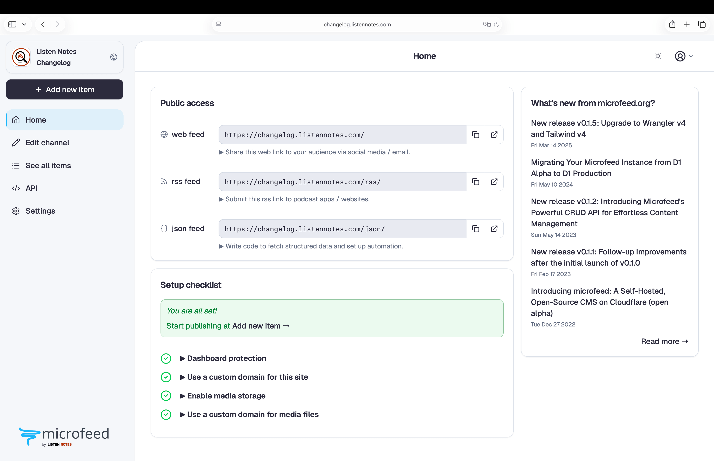
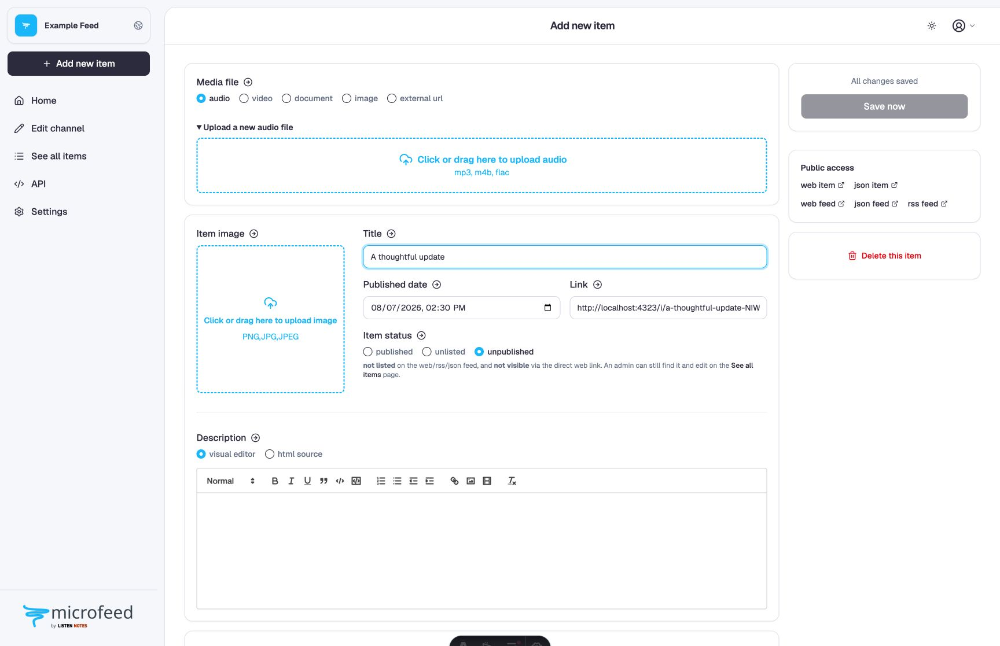
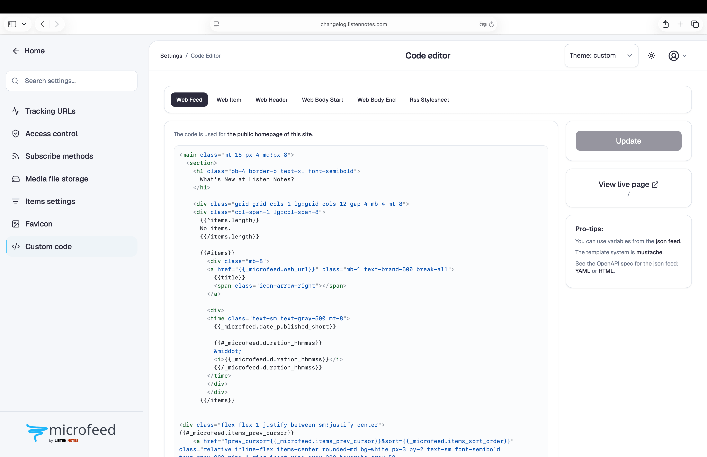

</br>
</br>
<div align="center">
  <a href="https://www.microfeed.org/" target="_blank">
  <picture>
    <source media="(prefers-color-scheme: dark)" srcset="https://user-images.githubusercontent.com/1719237/210119945-50e1d444-2d12-43d2-a96d-65bdbccecb70.png">
    
  </picture>
  </a>
</div>

<h1 align="center">microfeed: a lightweight cms self-hosted on cloudflare</h1>

  <p align="center">
    <a href="https://docs.microfeed.org"><b>Docs</b></a>   
    ·    
    <a href="https://www.microfeed.org/api/"><b>API</b></a>   
    ·        
    <a href="https://github.com/microfeed/microfeed/issues/new?assignees=&labels=bug"><b>Report Bug</b></a>
    ·
    <a href="https://github.com/microfeed/microfeed/discussions/new?category=ideas"><b>Request Feature</b></a>
    ·
    <a href="mailto:support@microfeed.org"><b>Email Us Privately</b></a>
  </p>

Welcome to microfeed, a lightweight content management system (CMS) self-hosted on Cloudflare.
With microfeed, you can easily publish a variety of content such as audios, videos, photos, documents, blog posts,
and external URLs to a feed in the form of web, RSS, and JSON. It's the perfect solution for tech-savvy individuals who
want to self-host their own CMS without having to run their own servers.

microfeed is built by [Listen Notes](https://www.listennotes.com/) and is hosted on Cloudflare's [Workers](https://workers.cloudflare.com/),
[R2](https://www.cloudflare.com/products/r2/), and [D1](https://developers.cloudflare.com/d1/).

If you have any questions or feedback, please don't hesitate to reach out to us at support@microfeed.org. We'd love to hear from you!

## 📚 Table of contents
[](https://github.com/microfeed/microfeed/actions/workflows/ci.yml)
[](mailto:support@microfeed.org)

* [⭐️ How it works](#%EF%B8%8F-how-it-works)
* [🚀 Installation](#-installation)
  * [Quickstarts](#quickstarts)
  * [Details](#details)
  * [Advanced](#advanced)
* [✍️ Start publishing](#%EF%B8%8F-start-publishing)
* [💻 FAQs](#-faqs)
* [💪 Contributions](#-contributions)
* [🛡️ License](#%EF%B8%8F-license)

## ⭐️ How it works

Since the 1990s, a significant portion of the web has been powered by feeds.
People (and bots) publish items to a feed, and others can subscribe to that feed to receive new content.

microfeed makes it easy for individuals to self-host their own feed on Cloudflare, including but not limited to
* a podcast feed of audios
* a blog feed of posts
* an Instagram-like feed of images (e.g., [llamacorn.listennotes.com](https://llamacorn.listennotes.com/), [brand-assets.listennotes.com](https://brand-assets.listennotes.com/))
* a YouTube-like feed of videos
* a personal website with custom links
* a content curation feed of external news article urls
* a marketing site with updates and press coverage (e.g., [microfeed.org](https://www.microfeed.org/))
* a headless CMS with a GUI dashboard, JSON Feed, and generated API docs. Explore the public demo’s [interactive API reference](https://www.microfeed.org/api/v1/), [OpenAPI JSON](https://www.microfeed.org/api/v1/openapi.json) and [YAML](https://www.microfeed.org/api/v1/openapi.yaml), or agent-ready [llms.txt](https://www.microfeed.org/api/v1/llms.txt) and [llms-full.txt](https://www.microfeed.org/api/v1/llms-full.txt).
* a list of domain names for sale (e.g., [ListenHost.com](https://www.listenhost.com/)...)
* a website for an entire book (e.g., [The Art of War](https://the-art-of-war.microfeed.org/))
* a changelog website (e.g., [changelog.listennotes.com](https://changelog.listennotes.com/))
* ...

microfeed uses Cloudflare [Workers](https://workers.cloudflare.com/) to host and run the code,
[R2](https://www.cloudflare.com/products/r2/) to host and serve media files,
[D1](https://developers.cloudflare.com/d1/) to store metadata,
and a built-in email and password login to protect the microfeed admin
dashboard.
Cloudflare provides very generous free usage quotas, making it an affordable solution for personal or small business use.
While you will still need to pay for a domain name, hosting microfeed on Cloudflare is essentially free.

With microfeed, you can publish a variety of content such as audios, videos, photos, documents, blog posts,
and external URLs to a customizable website, an RSS feed, and a [JSON feed](https://www.jsonfeed.org/).
Check out some examples of microfeed in action:
* Web feed: [https://llamacorn.listennotes.com/](https://llamacorn.listennotes.com/)
* Rss feed: [https://llamacorn.listennotes.com/rss/](https://llamacorn.listennotes.com/rss/)
* Json feed: [https://llamacorn.listennotes.com/json/](https://llamacorn.listennotes.com/json/)

microfeed provides a simple yet powerful admin dashboard: the site-management
area where you create and edit posts, upload media files, and customize how
your site looks. If you've used WordPress before, you'll find it familiar.

<p align="center">
  <a href="docs/public/images/screenshots/2-dashboard-1-home.png">
    
  </a>
  <a href="docs/public/images/screenshots/2-dashboard-2-add-item.png">
    
  </a>
</p>

[Back to 📚TOC](#-table-of-contents)

## 🚀 Installation

### Quickstarts

The simplest way to install microfeed is with a local AI coding agent:

1. Create a local copy of this Git repository on your computer. [Install Git](https://git-scm.com/downloads) first if
   the `git` command is not available on your computer:

   ```console
   git clone https://github.com/microfeed/microfeed.git
   ```

2. Open the new `microfeed` folder in an AI coding agent such as OpenAI Codex,
   Claude Code, Cursor, or another local agent that can run terminal commands
   and open a browser.

3. Give the agent this prompt:

   ```text
   Deploy microfeed to Cloudflare.
   ```

That's it. The agent guides the setup, runs the deployment, and verifies the
finished site. You only step in for Cloudflare browser authorization, choices
that require your approval, and creating your private dashboard password.


https://github.com/user-attachments/assets/96c73a94-2068-4172-9003-8bf3a262121d


### Details

microfeed has one supported deployment engine: `yarn manage`, run from a local
Git copy of this repository. A local AI coding agent can operate it for you, or
you can run the same guided commands yourself.

* **Recommended:** [deploy with an AI coding agent](https://docs.microfeed.org/start-here/ai-agent/).
* **Manual:** [deploy with `yarn manage`](https://docs.microfeed.org/start-here/manual/).
* **Every command and option:** read the [canonical `yarn manage` reference](https://docs.microfeed.org/manage-cli/).

Both paths pause for Cloudflare browser authorization and choices that require
your approval. Never paste a Cloudflare token, dashboard password, or private
password-setup link into an agent conversation or command.

[Back to 📚TOC](#-table-of-contents)

### Advanced

The documentation site covers advanced setup and ongoing management:

* [Manage your site](https://docs.microfeed.org/manage/)
* [Update microfeed](https://docs.microfeed.org/manage/update/)
* [Add a custom domain and manage authentication](https://docs.microfeed.org/manage/domains-and-access/)
* [Manage multiple local, production, and preview instances](https://docs.microfeed.org/manage/multiple-instances/)
* [Create snapshots and migrate older Pages installations](https://docs.microfeed.org/manage/backups-and-migrations/)
* [Check status and troubleshoot problems](https://docs.microfeed.org/manage/troubleshooting/)
* [Remove a deployment safely](https://docs.microfeed.org/manage/remove/)

For exact CLI behavior and safeguards, use the [canonical `yarn manage`
reference](https://docs.microfeed.org/manage-cli/).

[Back to 📚TOC](#-table-of-contents)

## ✍️ Start publishing

Once initialization is complete, your microfeed instance is ready to use.
From the microfeed admin dashboard, you can create, edit, or delete posts;
upload audio, video, images, and other media files when R2 is enabled; use
external URLs in content-only mode; and customize your site.

You can also customize the appearance of the website at Settings / Custom code by editing the raw HTML and CSS:



The HTML code is using [mustache.js](https://github.com/janl/mustache.js) as a templating language, where you can access to variables from Feed Json or Item Json. For example, on our marketing website [microfeed.org](https://www.microfeed.org/)'s home page (Feed Web), we use variables in the html code from [microfeed.org/json/](https://www.microfeed.org/json/), and on [an item's page](https://www.microfeed.org/i/introducing-microfeed-a-self-hosted-open-source-cms-on-cloudflare-open-alpha-uhbQEmArlC2/) (Item Web), we use variables from [${item_url}/json](https://www.microfeed.org/i/introducing-microfeed-a-self-hosted-open-source-cms-on-cloudflare-open-alpha-uhbQEmArlC2/json).

With the easy access to the json data of a microfeed instance (i.e., [Feed Json](https://www.microfeed.org/json/) and [Item Json](https://www.microfeed.org/i/introducing-microfeed-a-self-hosted-open-source-cms-on-cloudflare-open-alpha-uhbQEmArlC2/json), you can use it as a headless CMS and build your own client apps to display the content.

[Back to 📚TOC](#-table-of-contents)

## 💻 FAQs

<details>
<summary><b>How can I track podcast / video / image downloads?</b></summary>

To track podcast, video, or image downloads with microfeed, you can use the tracking URLs feature.
This allows you to set up third-party tracking URLs for your media files, such as those provided by [OP3](https://op3.dev/), [Podtrac](http://analytics.podtrac.com/)...

To set up tracking URLs, you will need to go to Settings / Tracking URLs:


From there, you can add the third-party tracking URLs that you want to use.
microfeed will automatically add these URLs to the front of the URL for your media files, allowing you to track download statistics.

This is a [common practice in the podcast industry](https://lowerstreet.co/blog/podcast-tracking) and can be a useful way to monitor the performance of your content and understand how it is being consumed by your audience.

</details>

<details>
<summary><b>Why Cloudflare? Isn't it dangerous to trust a for-profit company?</b></summary>

Many individuals and organizations trust and use Cloudflare's services because it has a reputation for providing reliable and effective services.
We ([Listen Notes](https://www.listennotes.com/)) have been using Cloudflare for many years.

It's convenient to manage all things on a one-stop platform like Cloudflare (e.g., DNS, Cache, firewall, running code, CDN, trustless logins...).

microfeed is still in open alpha phase. Cloudflare is the first platform we support.
We may consider supporting other serverless platforms, so you can easily migrate away if needed.
</details>


<details>
<summary><b>What if Cloudflare de-platforms my microfeed instance?</b></summary>

It is important to carefully review the terms of service for any service that you use, including Cloudflare.
It is possible that if you violate the terms of service, the service may take action, such as de-platforming your instance.

To protect against the possibility of being de-platformed, it is a good idea to regularly backup your data from Cloudflare.
This will allow you to recover your contents and potentially migrate them to a different platform if necessary.
It is also a good idea to use your own custom domain, as this will give you more control over your content and make it easier to move your data to a different platform if needed.
</details>


<details>
<summary><b>Why should I use microfeed?</b></summary>

If you are already using Cloudflare and are satisfied with its services, then using microfeed may be a good option for you.

If you don't want to manage your own servers, microfeed can be a convenient alternative that allows you to take advantage of
Cloudflare's infrastructure and security features.

If you don't want to pay for servers, microfeed can be a cost-effective solution, as Cloudflare provides generous free usage quotas.

If you are looking for something new and are interested in exploring different options, microfeed could be a good choice to consider.
It is always a good idea to carefully evaluate any service before using it to ensure that it meets your needs and is a good fit for your use case.
</details>

<details>
<summary><b>How can I download or back up my microfeed data?</b></summary>

microfeed stores metadata in Cloudflare D1 and media files in Cloudflare R2.
Create one portable, owner-readable archive containing the D1 schema and
durable data, migration history, the entire R2 bucket, object metadata, and
checksums:

```console
yarn manage snapshot create --instance production --output backup.tar.gz
```

You can also download a Cloudflare site and immediately create a new local copy
with its real content:

```console
yarn manage snapshot pull \
  --instance production \
  --local-instance production-copy
```

Restore archives only with a checkout whose migration history exactly extends
the snapshot's recorded history. Local restore requires a new local instance.
Cloudflare restore requires a newly initialized site with nonreused, unchanged
D1 and R2 resources, a successful dry run, and exact site-name confirmation.
See the canonical [`snapshot` command reference](docs/manage-cli.md#yarn-manage-snapshot)
for restore examples, migration rules, maintenance mode, and resume behavior.

The archive contains administrator password hashes and possibly private media.
It is unencrypted and created with owner-only file permissions, so store and
encrypt it according to your backup policy.

</details>

[Back to 📚TOC](#-table-of-contents)

## 💪 Contributions

We welcome bug fixes, features, tests, documentation, and other improvements.
Read [CONTRIBUTING.md](CONTRIBUTING.md) for local setup, architecture rules,
branch naming, validation, and pull request expectations. For substantial
features or architectural changes, please open an
[issue](https://github.com/microfeed/microfeed/issues/new) before starting.

[Back to 📚TOC](#-table-of-contents)

## 🛡️ License
microfeed is licensed under the [AGPL-3.0](https://github.com/microfeed/microfeed/blob/main/LICENSE) license. Please see [the LICENSE file](https://github.com/microfeed/microfeed/blob/main/LICENSE) for more information.

[Back to 📚TOC](#-table-of-contents)
